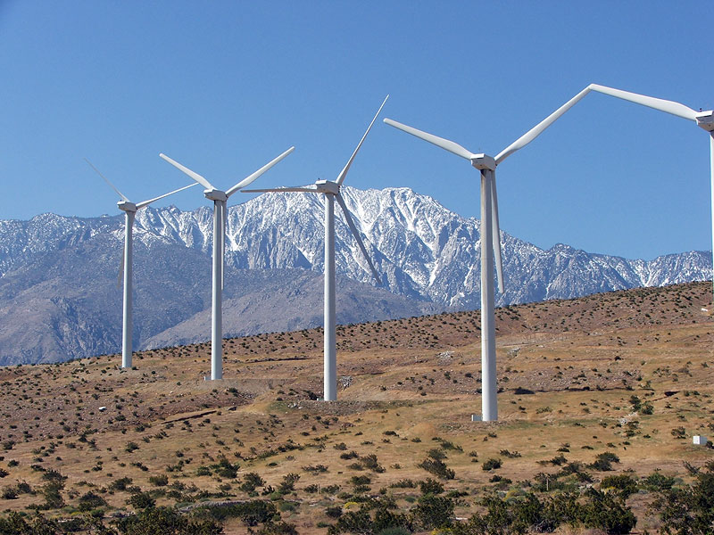

% Assignment 2 - Numerical Simulation
% Carlos Gonzalez Regalado
% Msc. Economics, Tilburg University

Introduction
================

Why Green Growth
----------

- Model behavior of innovator sector regarding clean technologies
- Account for incremental costs of R&D in research in both sectors

--------

- Previous model focused on the productivity of each sector in the production stage
- A first approach might include: 

$$E\lbrack TR_{c}\rbrack = \ Z_{c}\gamma\alpha^{(1 + \alpha)/(1 -\alpha)} A_{c} + (1 - Z_{c})\gamma\alpha^{(1 + \alpha)/(1 - \alpha)} A_{c}$$

---------
Costs of R&D
=========

R&D costs are incremental
-----------

- Cuadratic function to capture incremental costs which accounts for the other innovators' investments in R&D:

$$TC_{c} = A_{c}\lbrack \varepsilon z_{c}^{2} + \theta(z_{c} + z_{d})^{2} \rbrack/2$$

- Costs are the same for:
 - Clean Sector
 - Dirty Sector
 
---------

---------

- The possible harm that dirty industries can cause

---------

Conclusion
----------

- Proper incentives have to be derived to clean technogolies to arrive
- Governments should invest in basic research to decrease the costs of R&D
- Research on productivity increase for clean sector should be subsidized